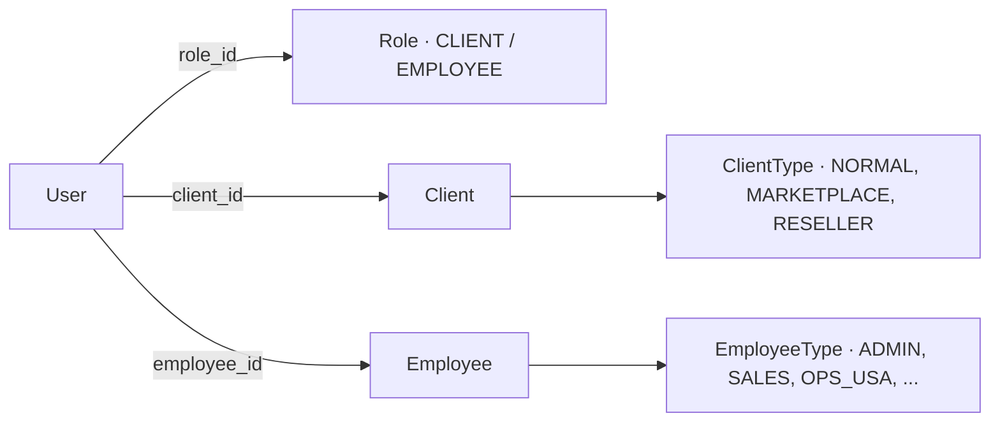
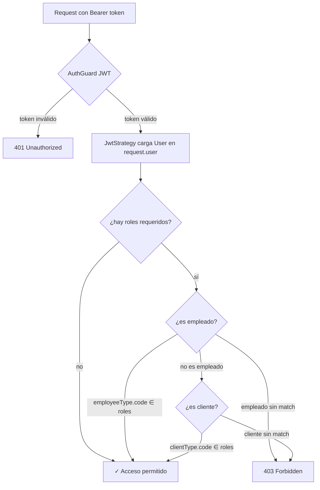

:::tip[TL;DR]
- Un usuario es **cliente XOR empleado**.
- Rol efectivo = `employeeType.code ?? clientType.code` (viaja en el claim `role` del JWT).
- Protege endpoints con **`@Auth(...roles)`** (valida JWT + rol).
- `@Auth()` sin args = cualquier usuario autenticado.
- Los códigos de `ValidRoles` deben **coincidir exactos** con la BD (match por string).
:::

Una vez que un usuario está [autenticado](/backend/authentication/), la **autorización** decide qué puede hacer. crs-backend usa control de acceso por **roles**, donde el rol efectivo se deriva de si el usuario es **empleado** o **cliente**.

:::note[Stack]
NestJS guards + `Reflector` (metadata) · Passport JWT · enum `ValidRoles`.
:::

## Modelo de identidad

La entidad central es `User`. Cada usuario tiene un `Role` básico y es **cliente o empleado** (no ambos):



Hay **dos niveles**:

- **`Role`** — nivel de acceso básico: `CLIENT` o `EMPLOYEE`. Identifica si el usuario es cliente o personal interno.
- **`ClientType` / `EmployeeType`** — el tipo fino, cuyo `code` es lo que se usa para autorizar.

### Rol efectivo

El rol contra el que se autoriza se toma del **tipo de empleado** y, si no hay, del **tipo de cliente**:

```ts
const role =
  user?.employee?.employeeType.code ?? user?.client.clientType.code;
```

Ese mismo `code` viaja en el claim `role` del JWT.

## Roles disponibles (`ValidRoles`)

El enum `ValidRoles` define los códigos válidos. El **valor** del enum es el `code` guardado en BD y contra el que se compara.

```ts title="src/auth/interfaces/roles/valid-roles.interface.ts"
export enum ValidRoles {
  // Tipos de cliente (client_types.code)
  Normal = 'NORMAL',
  Marketplace = 'MARKETPLACE',
  Reseller = 'RESELLER',

  // Tipos de empleado (employee_types.code)
  VendedorCRS = 'SALES',
  TesoreriaCRS = 'TREASURY',
  OperacionesUSA = 'OPS_USA',
  OperacionesLima = 'OPS_LIMA',
  Administrador = 'ADMIN',
  SuperAdministrador = 'SUPER_ADMIN',
  ShadowRoot = 'SHADOW_ROOT',
}
```

### Tipos de cliente

| `ValidRoles` | `code` | Acceso |
| --- | --- | --- |
| `Normal` | `NORMAL` | Cliente regular del sistema. |
| `Marketplace` | `MARKETPLACE` | Integración externa vía webhook/API (CompraFácil, Falabella). |
| `Reseller` | `RESELLER` | Sub-courier con clientes propios; crea paquetes manualmente. |

### Tipos de empleado

| `ValidRoles` | `code` | Acceso |
| --- | --- | --- |
| `Administrador` | `ADMIN` | Acceso total, gestión de usuarios y configuración. |
| `VendedorCRS` | `SALES` | Gestión de clientes, asignación de tarifas. |
| `TesoreriaCRS` | `TREASURY` | Pagos, vouchers, facturación. |
| `OperacionesUSA` | `OPS_USA` | Recepción de paquetes en USA, creación de AWBs. |
| `OperacionesLima` | `OPS_LIMA` | Gestión de paquetes en Lima, entregas. |
| `SuperAdministrador` | `SUPER_ADMIN` | Por encima del admin normal. |
| `ShadowRoot` | `SHADOW_ROOT` | Super admin total. |

:::caution[El match es por string]
Los valores del enum `ValidRoles` deben coincidir **exactamente** con el campo `code` de las tablas `employee_types` y `client_types`. El guard compara por string, no por ID.
:::

## Cómo se protege un endpoint: `@Auth()`

El decorador `@Auth(...roles)` combina autenticación (Passport JWT) y autorización por roles:

```ts title="src/auth/decorators/auth.decorator.ts"
export const Auth = (...args: ValidRoles[]) => {
  return applyDecorators(
    RoleProtected(...args),                  // guarda los roles como metadata
    UseGuards(AuthGuard(), UserRoleGuard),   // 1) valida JWT  2) valida roles
  );
};
```

Uso:

```ts
// Cualquier usuario autenticado (sin restricción de rol):
@Auth()
@Get('me')
getMe(@GetUser() user: User) { ... }

// Requiere autenticación + uno de los roles indicados:
@Auth(ValidRoles.Administrador, ValidRoles.SuperAdministrador)
@Get('admins')
listAdmins() { ... }
```

`@Auth(...roles)` aplica dos cosas:

1. `RoleProtected(...roles)` → guarda los roles permitidos como metadata (`SetMetadata('roles', ...)`).
2. `UseGuards(AuthGuard(), UserRoleGuard)` → primero valida el JWT, luego los roles.

## El `UserRoleGuard`

Tras validar el token, este guard decide el acceso:



En palabras:

1. Si el endpoint **no exige roles** (`@Auth()` sin argumentos) → basta estar autenticado.
2. Si el usuario es **empleado**, se valida contra `employee.employeeType.code`.
3. Si no, si es **cliente**, se valida contra `client.clientType.code`.
4. Si ninguno coincide → `403 Forbidden`.

> El empleado se evalúa **primero**: si un usuario tiene registro de empleado, su acceso se decide por el tipo de empleado, no por el de cliente.
