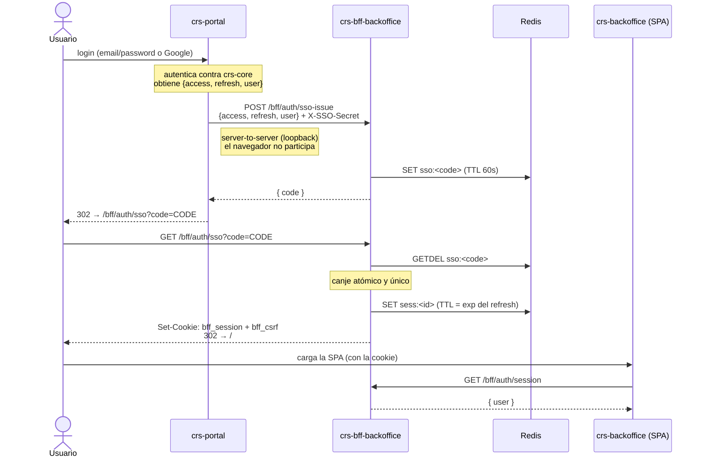
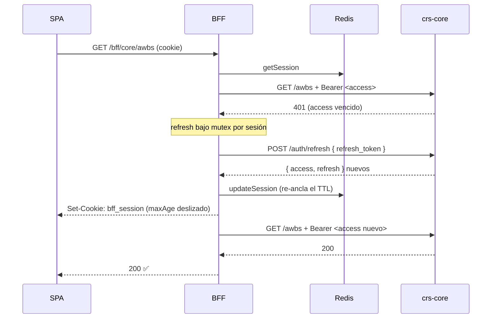
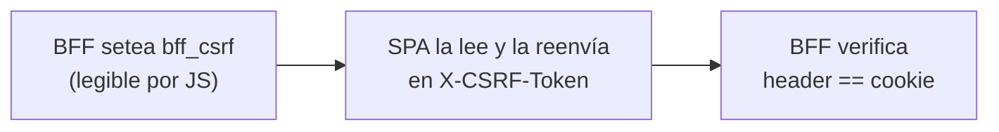

:::tip[TL;DR]
- El **login vive en `crs-portal`**; el backoffice no tiene pantalla de login propia.
- El portal no manda tokens por la URL: emite un **código opaco de un solo uso** que el BFF canjea server-to-server.
- La sesión son **dos cookies**: `bff_session` (opaca, `httpOnly`) y `bff_csrf` (legible por JS).
- Un `401` del upstream dispara un **refresh transparente** y un reintento — la SPA nunca lo ve.
- Un `401` que **sí** llega a la SPA significa sesión muerta: purgar y volver al login del portal.
:::

## El login vive en crs-portal

El backoffice **no tiene login propio**. El SSO de `crs-portal` autentica a todo el
ecosistema, y cuando el usuario resulta ser staff (`employeeTypeCode !== null`) lo manda
al backoffice.

El problema era **cómo** lo mandaba. Antes redirigía con los tokens en la query string:

```
${PUBLIC_ADMIN}/auth-callback?access_token=…&refresh_token=…
```

Eso es incompatible con el BFF, y además es malo por su cuenta: la URL queda en el
historial, en los logs de nginx y en el `Referer`. El navegador no debe ver un JWT nunca.

## Handoff SSO: código de un solo uso

La solución es el **patrón authorization-code**. El portal no le da tokens al navegador:
le da un **código opaco**, inútil por sí mismo, que el BFF canjea por dentro.



El navegador solo ve el código —de un solo uso y con 60 segundos de vida— y las cookies.
**Ningún JWT lo toca**: ni en JS, ni en `localStorage`, ni de forma útil en la URL.

### Por qué server-to-server para emitir el código

La alternativa era que el portal escribiera el código directo en el Redis del BFF con su
propio cliente. Se descartó: el portal es **stateless** (token-in-cookie, sin Redis) y es
la app de *casillero/clientes*. Hacerlo escribir en el Redis del backoffice acopla dos
concerns por un datastore compartido.

El `POST` server-to-server deja el acoplamiento como un **contrato HTTP explícito** y
mantiene al BFF como único dueño de su Redis. El portal solo suma una llamada HTTP por
loopback, sin dependencia de Redis.

### Las tres defensas del handoff

| Paso | Riesgo | Defensa |
| --- | --- | --- |
| `POST /sso-issue` | Cualquiera emite un código | Header `X-SSO-Secret`, comparado en **tiempo constante** (`timingSafeEqual`) — no filtra coincidencias parciales por timing |
| `GET /sso?code=` | Replay del código | **`GETDEL`**: canje atómico. El segundo intento no encuentra nada |
| El `302` final | Open redirect | Destino **fijo** (`/`). Nunca sale de un `next` del usuario |

El código es de 256 bits base64url, igual que el `sessionId`.

## Las dos cookies

Se emiten **siempre juntas**, en todo punto de creación de sesión, con un solo helper
(`setAuthCookies`). Si un flujo seteara la de sesión y olvidara la CSRF, la SPA se quedaría
sin token para el double-submit y su primera request mutante fallaría.

| Cookie | `httpOnly` | Contenido | Para qué |
| --- | --- | --- | --- |
| `bff_session` | **Sí** | ID opaco de 256 bits | Identifica la sesión en Redis. JS no la ve |
| `bff_csrf` | **No** | Token CSRF | La SPA la lee y la reenvía en `X-CSRF-Token` |

Que `bff_csrf` sea legible es **intencional**: es la mitad del double-submit. Ambas van con
`secure` y `sameSite` según config (`Lax` por defecto).

### La sesión en Redis

El TTL de la sesión se ancla al claim `exp` del **refresh token**, no a un reloj aparte —
así sesión y refresh caducan juntos y no hay estados imposibles.

```ts title="src/session/session.store.ts"
// El TTL se re-ancla en cada escritura → ventana deslizante.
const write = async (id: string, session: Session): Promise<void> => {
  const ttl = refreshExp(session.refreshToken) - Math.floor(Date.now() / 1000);
  await redis.set(key(id), JSON.stringify(session), 'EX', Math.max(ttl, 1));
};
```

El BFF **no verifica la firma** del refresh para leer el `exp`: el token viene de
`crs-core`, ya es de confianza. Solo decodifica el claim.

## Probe de sesión

La cookie es `httpOnly`, así que **JS no puede saber si hay sesión**. La única forma es
preguntarle al BFF. Eso sustituye al viejo gate por `localStorage.token`:

```ts title="crs-backoffice/src/lib/auth-session.ts"
export const probeSession = async (): Promise<CurrentUser | null> => {
  const res = await fetch(`${AUTH_BASE}/session`, { credentials: 'include' });
  if (!res.ok) return null;
  const data = (await res.json()) as SessionResponse;
  return data.user;
};
```

El store de auth corre el probe una vez al montar y arranca en `sessionStatus: 'loading'`
— no en `unauthenticated`. Eso evita el flash de UI autenticada con un `user` persistido de
una sesión que ya murió. La respuesta siembra el `user`, así que los guards de rol tienen
datos de inmediato, sin una ventana de `authenticated` + `user = null`.

## Refresh transparente

Cuando el access token vence, el upstream responde `401`. El BFF lo intercepta, rota los
tokens y **reintenta una sola vez**. La SPA nunca ve ese `401` ni se entera de la rotación.



### El mutex por sesión

Un dashboard dispara muchas requests a la vez. Si el access vence, **todas** reciben `401`
al mismo tiempo — y sin coordinación cada una lanzaría su propia rotación contra
`crs-core`, invalidándose entre sí.

`refreshSession` colapsa los refresh concurrentes de una misma sesión en uno solo:

```ts title="src/auth/token-refresh.ts"
const inflight = new Map<string, Promise<Session>>();

export const refreshSession = (sessionId: string, stale: Session): Promise<Session> => {
  const pending = inflight.get(sessionId);
  if (pending) return pending;

  const task = rotate(sessionId, stale).finally(() => inflight.delete(sessionId));
  inflight.set(sessionId, task);
  return task;
};
```

Y dentro de `rotate` hay una segunda guarda: otra request pudo haber refrescado mientras
esta esperaba su turno, así que se relee Redis y, si el access ya cambió, se reusa ese par
en vez de rotar con un refresh viejo.

:::caution[El mutex es in-memory]
`inflight` vive en la memoria del proceso. Es correcto porque el BFF corre con
`instances: 1`. **Si va a cluster, el lock debe moverse a Redis.**
:::

### Qué falla y cómo

No todo error de refresh mata la sesión. La distinción importa: un hipo de `crs-core` no
debería desloguear a nadie.

| Respuesta de `/auth/refresh` | Interpretación | Qué hace el BFF |
| --- | --- | --- |
| `401` | Refresh muerto (vencido, rotado fuera de la gracia, o sesión borrada) | Destruye la sesión, limpia cookies, `401` a la SPA |
| `5xx` o error de red | Fallo transitorio del upstream | `502` a la SPA, **la sesión sobrevive** |

Un `401` que llega a la SPA significa entonces una sola cosa: **la sesión está muerta y el
refresh del BFF ya falló**. No hay que llamar a logout ni tocar tokens (no existen en el
navegador) — solo purgar el store persistido y volver al login del portal.

### La cookie que se desliza

Tras un refresh, el BFF **re-emite la cookie de sesión**. No es redundante: si no lo
hiciera, el navegador la tiraría a los 60 días del login aunque la sesión en Redis siguiera
viva, rompiendo la ventana deslizante justo en el borde. El `maxAge` de la cookie desliza
con la actividad, igual que el TTL de Redis.

Hay un detalle de implementación fácil de perder: `setCookie()` escribe en `c.res`, pero el
handler devuelve una `Response` nueva, así que el `Set-Cookie` se perdería. El relay lo
traslada a mano.

## CSRF: double-submit

Con la sesión en cookie, el navegador la manda sola en toda request al origen — así que un
sitio atacante podría disparar métodos mutantes montado en la sesión del usuario.
`SameSite=Lax` corta el grueso; el double-submit es la **defensa en profundidad**.



Un origen atacante **no puede leer** la cookie (same-origin policy), así que no puede
falsificar el header. La comparación también es en tiempo constante.

Aplica solo a `POST`, `PUT`, `PATCH` y `DELETE`. Los `GET`/`HEAD`/`OPTIONS` se eximen —
no mutan, y así el SSE de notificaciones y las descargas pasan sin fricción.

Del lado de la SPA lo agrega un interceptor de axios, salvo en los `fetch` crudos (como el
logout), que lo mandan a mano.

## Qué se le corta al upstream

El proxy no reenvía la request tal cual. Hay headers que se descartan por seguridad:

| Header | Por qué se corta |
| --- | --- |
| `cookie` | La cookie de sesión es **solo del BFF**; el upstream no la necesita ni debe verla |
| `authorization` | Lo pone el BFF desde Redis — un `Bearer` que mande el cliente no vale nada aquí |
| `origin` / `referer` | Para que `crs-core` vea una llamada server-to-server. Su `VerifyOriginGuard` deja pasar requests sin `Origin`; si se reenviaran, sacar el backoffice de `ALLOWED_ORIGINS` daría `403` |

El resto (`host`, `content-length`, `connection`, `transfer-encoding`…) son hop-by-hop o de
longitud: los recalcula `fetch` por conexión.

En la respuesta se cortan `content-encoding` y `content-length` —`fetch` ya descomprimió el
body, y reenviarlos haría que el navegador intente decodificar dos veces— y `set-cookie`,
porque las únicas cookies del origen son las del BFF.

:::note[Timeouts]
El proxy acota el upstream en **30 s**, y el refresh en **10 s**. El timeout cuenta solo
**hasta la respuesta**, no el body: por eso los dashboards pesados caben y el **SSE de
notificaciones no se corta**.
:::

## Logout

`POST /bff/auth/logout` cierra la sesión en `crs-core`, borra la sesión de Redis y limpia
ambas cookies. Está protegido por CSRF: sin él, un sitio atacante podría forzar el
deslogueo.

Del lado del front, el logout local **procede aunque el BFF falle** — purga el store y
redirige igual. Un error de red no debe dejar al usuario atrapado en una sesión que él ya
dio por cerrada.

## `POST /bff/auth/login`

El BFF **implementa** un login directo: valida credenciales con zod, las envía a
`crs-core`, crea la sesión y devuelve solo el `user` (nunca los tokens).

Hoy **no lo usa nadie**. El backoffice entra por el handoff SSO y no tiene pantalla de
login propia. El endpoint queda disponible para cuando el backoffice tenga la suya, sin
volver a diseñar el flujo: la pieza server-side ya existe y está probada.

:::note
Si te encuentras este endpoint en el código, no es código muerto — es la mitad ya
construida de una funcionalidad futura.
:::
