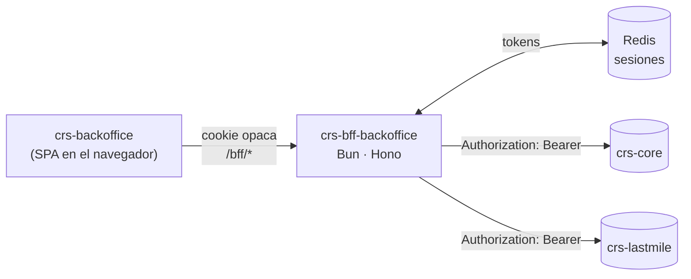

:::tip[TL;DR]
- **Proxy de auth** entre `crs-backoffice` (SPA) y los backends (`crs-core`, `crs-lastmile`).
- Los **JWT viven server-side en Redis**; el navegador solo tiene una **cookie opaca** `httpOnly`.
- Todo cuelga de `/bff/*`, **same-origin** con la SPA (nginx en prod, proxy de Vite en dev).
- Inyecta el `Authorization: Bearer` en cada request y **refresca los tokens de forma transparente**.
- El **login no vive aquí**: entra por el SSO de `crs-portal` vía [handoff con código de un solo uso](/bff-backoffice/auth-flow/).
:::

**crs-bff-backoffice** es el Backend-for-Frontend de `crs-backoffice`. No tiene lógica de
negocio propia: su único trabajo es **sostener la sesión** y que ningún token llegue al
navegador.

:::note[Stack]
Bun (corre TypeScript nativo, sin build) · Hono · Redis vía `ioredis` · zod para validar
el entorno · Biome para formato y lint. Cookies, logger, CSRF y generación de IDs son
built-in (`hono/*`, Web Crypto).
:::

## Por qué existe

Antes, la SPA guardaba el par `access`/`refresh` en `localStorage` y lo adjuntaba a cada
request. Eso significa que **cualquier XSS en el backoffice se lleva la sesión completa**:
`localStorage` es legible por todo el JS del origen, incluida cualquier dependencia
comprometida. Y un refresh de 60 días robado es una sesión de 60 días robada.

El BFF mueve los tokens fuera del alcance del navegador. El cliente pasa a tener una
**cookie opaca `httpOnly`** — un identificador de sesión que por sí solo no sirve contra
ningún backend, que JS no puede leer y que no se puede exfiltrar con un XSS.

| | Antes | Con el BFF |
| --- | --- | --- |
| Dónde viven los tokens | `localStorage` del navegador | Redis, server-side |
| Qué tiene el cliente | `access` + `refresh` | cookie opaca `bff_session` (`httpOnly`) |
| Quién adjunta el `Bearer` | la SPA | el BFF |
| Quién maneja el refresh | la SPA, con un mutex propio | el BFF, transparente |
| Superficie de un XSS | sesión completa, 60 días | nada explotable fuera del origen |

## Topología

La SPA **no habla con los backends**. Habla con `/bff/*` en su propio origen, y el BFF
reenvía:



Todo el BFF cuelga del prefijo `/bff` (`BFF_BASE_PATH`). El resto del origen lo sirve el
build estático de la SPA.

| Ruta | Qué hace |
| --- | --- |
| `/bff/health` | Healthcheck. |
| `/bff/auth/*` | Login, logout, probe de sesión y handoff SSO. Ver [Flujo de autenticación](/bff-backoffice/auth-flow/). |
| `/bff/core/*` | Proxy a `crs-core` — el prefijo se consume: `/bff/core/awbs/1` → `crs-core` `/awbs/1`. |
| `/bff/lastmile/*` | Proxy a `crs-lastmile`, misma regla. |

El catch-all del proxy se monta **último**, o se comería `/health` y `/auth/*`.

### Cómo llega el tráfico

En **producción**, nginx enruta `/bff/*` al proceso del BFF (que escucha en `127.0.0.1`,
nunca expuesto directo) y todo lo demás al build estático. En **desarrollo**, el proxy de
Vite reenvía `/bff` a `VITE_BFF_URL`. En ambos casos la SPA usa **rutas relativas**, así
que para el navegador es un solo origen y la cookie viaja sola.

```bash title="crs-backoffice/.env"
VITE_CORE_API_URL=/bff/core
VITE_LASTMILE_API_URL=/bff/lastmile
VITE_BFF_URL=http://127.0.0.1:4000   # destino del proxy de Vite (solo dev)
```

## Endpoints de crs-core bloqueados

El proxy es transparente por diseño, y eso abre un agujero: si la SPA llamara a
`/bff/core/auth/login`, `crs-core` devolvería un par de JWT en el body y el proxy se lo
entregaría al navegador — justo lo que el BFF existe para impedir. Por eso hay una lista
negra explícita:

```ts title="src/proxy/upstream-router.ts"
const BLOCKED = new Set([
  '/auth/login',
  '/auth/register',
  '/auth/google',
  '/auth/refresh',
]);
```

El chequeo se hace sobre el path **normalizado** (minúsculas, sin slash final) porque
Express y Nest matchean rutas case-insensitive y con slash opcional: `/auth/LOGIN` o
`/auth/login/` llegarían igual al endpoint y esquivarían un bloqueo literal. El path que
se reenvía queda intacto.

Estos flujos tienen su equivalente propio en `/bff/auth/*`, y el refresh lo hace el BFF
por dentro — la SPA no tiene por qué llamarlos.

## Estructura del repo

```
src/
├── index.ts                 # entrypoint: Bun.serve en 127.0.0.1:BFF_PORT
├── app.ts                   # arma el Hono app (middleware + rutas), sin listen
├── config/
│   ├── env.ts               # valida el entorno con zod
│   ├── upstreams.ts         # core→crs-core, lastmile→crs-lastmile
│   ├── paths.ts             # BFF_BASE_PATH (/bff)
│   └── cookies.ts           # opciones de la cookie de sesión y la CSRF
├── session/
│   ├── redis.ts             # cliente ioredis (singleton)
│   ├── session.store.ts     # create/get/update/destroy — los tokens viven aquí
│   └── session.types.ts
├── auth/
│   ├── auth.routes.ts       # /login, /logout, /session, /sso-issue, /sso
│   ├── auth.service.ts      # habla con crs-core /auth/login y /auth/refresh
│   ├── sso.service.ts       # valida el X-SSO-Secret del handoff (tiempo constante)
│   └── token-refresh.ts     # refresh transparente + lock por sesión
├── proxy/
│   ├── proxy.routes.ts      # catch-all: todo lo demás bajo /bff/*
│   ├── proxy.handler.ts     # forward + inyecta Bearer + 401→refresh→retry
│   └── upstream-router.ts   # prefijo de path → base URL del upstream
├── middleware/
│   ├── session.middleware.ts
│   ├── csrf.middleware.ts   # double-submit en métodos mutantes
│   ├── error.middleware.ts
│   └── logger.middleware.ts
├── lib/
│   ├── cookies.ts
│   ├── tokens.ts
│   └── upstream-fetch.ts    # fetchWithTimeout (acota el TTFB, no el body)
└── types/
    └── context.ts           # tipado de c.var de Hono
```

## Configuración

El entorno se valida con zod al arrancar: **config inválida = el proceso no levanta**.
Mejor fallar en el arranque que a mitad de una request.

| Variable | Default | Para qué |
| --- | --- | --- |
| `BFF_HOST` / `BFF_PORT` | `127.0.0.1` / `4000` | Dónde escucha. Loopback: nginx es quien expone. |
| `REDIS_HOST` / `REDIS_PORT` / `REDIS_PASSWORD` | `127.0.0.1` / `6379` / — | Conexión a Redis. Campos separados (una URL `redis://` se rompe con contraseñas en base64). |
| `REDIS_KEY_PREFIX` | — (requerido) | Namespace por entorno: `crs-bff-dev`, `-staging`, `-prod`. |
| `SESSION_TTL_SECONDS` | 60 días | `maxAge` de la cookie de sesión. |
| `UPSTREAM_CORE_URL` / `UPSTREAM_LASTMILE_URL` | — (requerido) | Base URL de cada backend. |
| `SESSION_COOKIE_NAME` / `CSRF_COOKIE_NAME` | `bff_session` / `bff_csrf` | Nombres de cookie. |
| `COOKIE_SECURE` / `COOKIE_SAMESITE` | `true` / `Lax` | Flags de cookie. En dev sobre HTTP, `COOKIE_SECURE=false`. |
| `SSO_HANDOFF_SECRET` | — (requerido) | Secreto compartido con `crs-portal` para el handoff. |
| `SSO_CODE_TTL_SECONDS` | `60` | Vida del código del handoff (se canjea de inmediato). |

Las claves en Redis quedan como `<REDIS_KEY_PREFIX>:sess:<id>` y
`<REDIS_KEY_PREFIX>:sso:<code>`. El prefijo es config; el sub-namespace lo pone el código.

## Despliegue

CI/CD por GitHub Actions sobre SSH (`.github/workflows/deploy.yml`): `push staging` va a
staging, `push main` a producción. La config de PM2 y nginx está versionada en `crs-infra`
— no se edita a mano en el servidor.

:::caution[El BFF corre con `instances: 1`]
El mutex que colapsa los refresh concurrentes vive **en memoria del proceso**
(ver [refresh transparente](/bff-backoffice/auth-flow/#refresh-transparente)). Con una sola
instancia es correcto. Si algún día el BFF va a cluster, ese lock **debe moverse a Redis**
antes, o cada instancia rotaría tokens por su cuenta e invalidaría las de las demás.
:::

:::note[Orden de despliegue]
Desplegar la **SPA antes que el BFF**. La verificación CSRF rechaza las requests mutantes
que no traigan el header; si el BFF se activa primero, una SPA vieja que aún no lo envía
empezaría a recibir `403`.
:::
