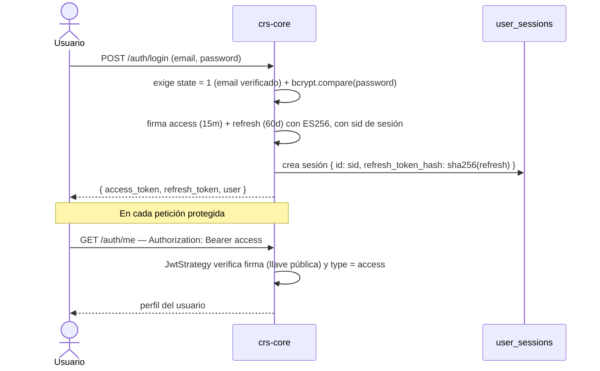

:::tip[TL;DR]
- **JWT ES256** asimétrico: privada firma, pública verifica (sin secretos compartidos).
- Login → **access (15 min)** + **refresh (60 días)**.
- En cada request: `Authorization: Bearer <access>`.
- **Multi-sesión**: cada login crea una sesión (fila en `user_sessions`); el token lleva su `sid` (id de sesión/dispositivo).
- El refresh **se rota** en cada uso; reusar el anterior → `401` (salvo una **ventana de gracia de 60 s**).
- Login exige **email verificado** (`state = 1`).
:::

El módulo `auth` de **crs-core** centraliza la identidad del sistema: registro y login de usuarios, emisión de tokens, login con Google y recuperación de contraseña. Esta página cubre **cómo se autentica** un usuario. Para qué puede hacer cada uno una vez autenticado, ver [Autorización](/core/authorization/).

:::note[Stack]
NestJS 11 · TypeORM · Passport (`passport-jwt`) · JWT **ES256** (ECDSA P-256, asimétrico) · bcrypt.
:::

## JWT con firma asimétrica (ES256)

Los tokens se firman con **ES256** (curva elíptica P-256). crs-core firma con su **llave privada** (`JWT_PRIVATE_KEY`) y verifica con su **llave pública** (`JWT_PUBLIC_KEY`). No hay secretos compartidos.

```ts title="src/auth/config/jwt.config.ts"
export interface JwtConfig {
  privateKey: string; // JWT_PRIVATE_KEY — firma
  publicKey: string;  // JWT_PUBLIC_KEY  — verificación
}
```

El payload de cada token tiene esta forma:

```ts title="src/auth/interfaces/auth/jwt-payload.interface.ts"
export type TokenType = 'access' | 'refresh';

export interface JwtPayload {
  sub: number;    // id del usuario
  email: string;
  role: string;   // código del rol efectivo (ver Autorización)
  type: TokenType;
  sid: string;    // id de la sesión (fila en user_sessions) — identifica el dispositivo
  iat?: number;
  exp?: number;
}
```

## Par de tokens: access + refresh

Cada autenticación emite **dos tokens** (`issueTokenPair`):

| Token | `type` | Vigencia | Uso |
| --- | --- | --- | --- |
| **access token** | `access` | **15 minutos** | Se envía en cada petición: `Authorization: Bearer <token>`. |
| **refresh token** | `refresh` | **60 días** | Renueva el par sin volver a loguearse. Se **rota** en cada uso. |

### Sesiones por dispositivo (`user_sessions`)

crs-core soporta **múltiples sesiones simultáneas** del mismo usuario (varios dispositivos). Cada login/registro/Google crea una **fila nueva** en `user_sessions`, identificada por un UUID que viaja como claim `sid` en ambos tokens. El refresh token **no se guarda en claro**: se guarda su `sha256` en `user_sessions.refresh_token_hash` de **esa** sesión.

```ts title="src/auth/entities/user-session.entity.ts"
@Entity('user_sessions')
export class UserSession {
  id: string;                          // UUID — viaja como `sid` en el JWT
  userId: number;
  refreshTokenHash: string;            // sha256(refresh) en hex — rotado en cada refresh
  previousTokenHash: string | null;    // hash anterior, válido durante la ventana de gracia
  previousTokenExpiresAt: Date | null; // fin de la ventana de gracia
  device: string | null;               // etiqueta opcional (User-Agent)
  lastUsedAt: Date;
  expiresAt: Date;
}
```

### Rotación del refresh token

Cuando se usa en `POST /auth/refresh`:

1. Se verifica la firma (ES256, llave pública) y que `type === 'refresh'`.
2. Se exige `sid` y que exista la sesión `(sid, userId)` en `user_sessions`; si no → **`Sesión no válida`**. (Los refresh emitidos antes de la migración a multi-sesión no tienen `sid` y se rechazan.)
3. Se compara `sha256(token entrante)` contra `refreshTokenHash` de la sesión.
   - Si no coincide, se acepta también `previousTokenHash` mientras siga dentro de la **ventana de gracia** (`REFRESH_GRACE_MS = 60 s`). Esto tolera un reintento cuando el refresh anterior se cortó (p. ej. red móvil) y el cliente nunca recibió el token nuevo.
   - Si no coincide con ninguno → **`Refresh token ya utilizado`**.
4. Se emite un **par nuevo** y se rota la sesión: el hash saliente pasa a `previousTokenHash` con 60 s de gracia, y `refreshTokenHash` toma el nuevo.

`POST /auth/logout` **borra la fila** de la sesión actual (cierra solo ese dispositivo). Internamente, `logout(userId, sessionId?)` sin `sessionId` borraría **todas** las sesiones del usuario, pero el endpoint siempre pasa el `sid` del token, así que cierra únicamente la sesión en curso.



## Verificación en cada petición: `JwtStrategy`

La estrategia de Passport extrae el Bearer token, lo verifica con la **llave pública** y el algoritmo `ES256`, **rechaza los tokens que no sean de tipo `access`**, carga el `User` con sus relaciones de rol/empleado/cliente, y **propaga el `sid`** a la request para que `logout` sepa qué dispositivo cerrar.

```ts title="src/auth/strategies/jwt.strategy.ts"
super({
  jwtFromRequest: ExtractJwt.fromAuthHeaderAsBearerToken(),
  ignoreExpiration: false,
  secretOrKey: jwtConfigValues.publicKey,
  algorithms: ['ES256'],
  passReqToCallback: true,
});

async validate(req: Request, payload: JwtPayload): Promise<User> {
  if (payload.type !== 'access') {
    throw new UnauthorizedException('Token de acceso requerido');
  }
  // carga User con role, employee.employeeType y client.clientType;
  // rechaza si state !== 1 (email sin verificar o cuenta desactivada)
  req.sessionId = payload.sid; // lo consume @GetSessionId() en logout
}
```

El `User` resultante queda disponible en `request.user` y se obtiene en los controladores con el decorador `@GetUser()`. El `sid` se obtiene con `@GetSessionId()`.

## Flujos de autenticación

### Registro

`POST /auth/register` crea la cuenta con email y contraseña (hasheada con `bcrypt`, 10 rondas). El usuario queda **sin verificar** (`state ≠ 1`) y se le envía un correo de verificación. No puede iniciar sesión hasta verificarlo.

### Verificación de correo

`GET /auth/verify-email?token=<token>` activa la cuenta (`state = 1`) usando el token enviado en el correo de registro.

### Login

`POST /auth/login` con email y contraseña:

1. Exige que el correo esté verificado (`state === 1`), si no → `401`.
2. Si la cuenta se creó con Google (sin contraseña) → `401` indicando usar "Continuar con Google".
3. Compara la contraseña con `bcrypt.compare`.
4. Crea una sesión nueva, emite el par de tokens y retorna `{ access_token, refresh_token, user }`.

### Login con Google

`POST /auth/google` recibe un access token de Google, valida la identidad contra la API de Google y **crea la cuenta si no existe** o inicia sesión si ya existe. Los usuarios de Google completan luego su perfil con `PATCH /auth/me/complete-profile`.

### Recuperación de contraseña

- `POST /auth/lost-password` envía un correo con un enlace de recuperación, válido por **1 hora**.
- `POST /auth/reset-password` actualiza la contraseña con el token recibido. El token se invalida tras usarse.

## Endpoints

:::tip[Referencia interactiva]
La lista completa con parámetros, cuerpos, respuestas y schemas está en la **[Referencia API → Autenticación](/core/api/operations/tags/autenticación/)** (generada desde el OpenAPI del backend). La tabla siguiente es solo un resumen.
:::

| Método | Ruta | Protegido | Descripción |
| --- | --- | --- | --- |
| `POST` | `/auth/register` | — | Registra un usuario y envía correo de verificación. |
| `GET`  | `/auth/verify-email` | — | Verifica el correo con el token recibido. |
| `POST` | `/auth/login` | — | Login con email y contraseña. |
| `POST` | `/auth/google` | — | Login/registro con Google OAuth. |
| `POST` | `/auth/refresh` | — | Renueva el par de tokens (rota el refresh). |
| `POST` | `/auth/lost-password` | — | Solicita recuperación de contraseña. |
| `POST` | `/auth/reset-password` | — | Confirma el cambio de contraseña. |
| `POST` | `/auth/logout` | `@Auth()` | Cierra la sesión (dispositivo) actual: borra su fila en `user_sessions`. |
| `GET`  | `/auth/me` | `@Auth()` | Perfil del usuario autenticado. |
| `PATCH` | `/auth/me/complete-profile` | `@Auth()` | Completa el perfil (principalmente usuarios de Google). |

> El control de **quién** puede acceder a cada endpoint protegido se hace con el decorador `@Auth(...roles)`. Eso se explica en [Autorización](/core/authorization/).
