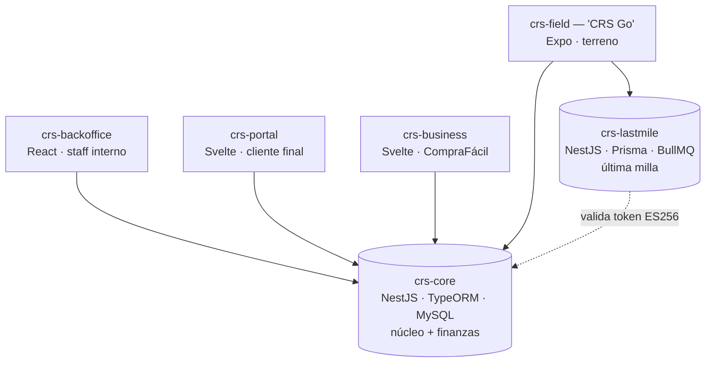

Bienvenido al ecosistema **CRS** (Courier & Logistics Management). Esta página es el
mapa: si es tu primer día, léela completa antes de clonar nada.

## Qué es CRS

CRS gestiona el ciclo completo de un paquete: desde que **ingresa** (importación,
aduanas, bodega, casilleros) hasta que se **entrega** en la puerta del cliente
(última milla). Son **dos backends** y **cuatro clientes** (tres web + una móvil),
más este sitio de documentación.

## El ecosistema de un vistazo

## Los repositorios

| Repo | Qué es | Stack | A quién sirve |
|------|--------|-------|---------------|
| **crs-core** | Backend núcleo: inbound, aduanas, bodega, casilleros, **finanzas**. Emite los tokens. | NestJS 11 · TypeORM · MySQL | — (lo consumen los demás) |
| **crs-lastmile** | Backend de última milla: despachos, envíos, couriers. _En construcción._ | NestJS 11 · Prisma · BullMQ · S3 | crs-field |
| **crs-backoffice** | Consola web interna del staff (AWBs, manifiestos, facturas, pagos…). | React 19 · Vite | Staff / oficina |
| **crs-portal** | Portal web self-service del cliente final (sus casilleros y paquetes). | SvelteKit | Cliente final |
| **crs-business** | App web operativa de la línea CompraFácil (pedidos, manifiestos, consignees). | Svelte | Operación CompraFácil |
| **crs-field** | App móvil de terreno. Multi-rol: courier (rutas) + staff (escaneo de AWBs). | Expo / React Native | Couriers + staff en terreno |

:::note[Marca ≠ repo]
La app móvil se llama **"CRS Go"** de cara al usuario (es su marca en la store), pero su
**repositorio** es `crs-field`. Son dos nombres distintos a propósito — el cliente nunca
ve el nombre del repo.
:::

## Cómo se conectan

Los dos backends usan **autenticación ES256 (JWT asimétrico)**: `crs-core` firma los
tokens con su llave privada, y `crs-lastmile` los **verifica** con la llave pública de
core (no los emite). Gracias a esa verificación cruzada, **un solo token sirve en ambos
backends** — por eso `crs-field` puede hablar con los dos sin re-loguearse.

Los backends **no se llaman entre sí** (no hay RPC). Detalle completo en
[Autenticación de crs-core](/core/authentication/).

## La convención de nombres

Para que cualquier repo futuro se nombre sin improvisar:

- Prefijo **`crs-`** en todos (namespace del producto).
- **Backends → por _bounded context_** (el dominio que poseen): `crs-core`, `crs-lastmile`.
- **Frontends/apps → por _esfera de operación_** (a quién sirven): `crs-backoffice` (oficina),
  `crs-portal` (cliente), `crs-business` (línea), `crs-field` (terreno).
- Principio clave: **nombre de repo ≠ marca ≠ dominio de deploy ≠ bundle id.**

## Por dónde empezar (setup)

1. Clona el repo que vas a tocar (ver tabla arriba).
2. Copia `.env.example` → `.env` y completa los valores (pídelos al lead).
3. Instala dependencias e inicia en local — los comandos exactos están en el **README**
   de cada repo.
4. Para entender un backend en profundidad, sigue su sección en el sidebar.

:::tip
Cada repo tiene su propio `README` con el setup específico (deps, variables, cómo correr).
Esta página es el _mapa_; el README es el _"corre esto"_.
:::
